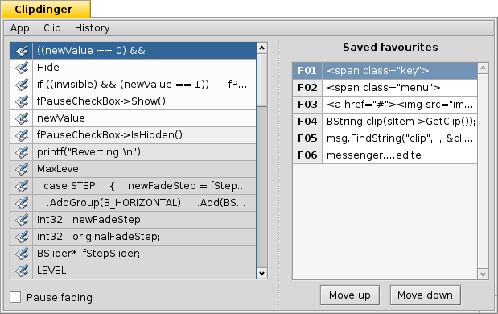

 **Clipdinger** for [Haiku](http://www.haiku-os.org)

* * *

Clipdinger is a small tool to manage a history of the system clipboard. It solves the problem that you often have to paste some text you've just recently copied to the clipboard, but that has been replaced by something you've copied more recently... It also saves the history so it'll appear just as you left it on the last shutdown.

If you want to paste some text that isn't in the clipboard any more, simply hit _SHIFT_ + _ALT_ + _V_ to summon the Clipdinger window. Here you can select an entry with the _CursorUp/Down_ keys and paste it by hitting _RETURN_. _ESCAPE_ minimizes the window without pasting.

Here's the main window with a few entries in the history and the settings window when choosing _Settings..._ from the History menu:

The settings window has currently only one option: the number of entries in the history (the default is 50). 
Keep in mind that every clipping is kept in memory and if you copy many large blocks of text, you may clog up your memory. Though, for everyday use, where clippings are seldom larger than a few KiBs, having a few dozen entries in the history shouldn't tax memory noticeably.

Once the limit of the history is reached, the oldest entry is removed automtically to make room for the new clipping.

You can remove an entry by selecting it and pressing _DEL_ or remove the complete clipboard history with _Clear history_ from the History menu.

### Tips & Tricks

*   Obviously, Clipdinger can only keep a clipboard history while it's running. You should therefore create a link to it in the `/boot/home/config/settings/boot/launch/` folder. Then it gets started automatically on every boot-up.

*   If you're interested in how much memory your history uses, have look at its save-file `/boot/home/config/settings/Clipdinger/Clipdinger_history`. Note, this file is only written after Clipdinger has quit. To get a current reading you'd have to quit and restart Clipdinger.

### Download

Clipdinger is directly available through HaikuDepot from the HaikuPorts repository.  
 You can also build it yourself using [Haikuporter](https://github.com/haikuports). The source is hosted at [GitHub](https://github.com/humdingerb/clipdinger).

### Bugreports & Feedback

Please use GitHubs's [issue tracker](https://github.com/humdingerb/clipdinger/issues) if you experience unusual difficulties or email your general feedback to [me](mailto:humdinger@gmail.com). Also, email me if you'd like to provide more localizations.

### Thanks

I have to thank Werner Freytag who created ClipUp for BeOS which was my inspiration and motivation to work on Clipdinger, to have a similar tool that works as I expect it to under Haiku. I pretty much copied his input_server device and filter...  
 Also, thanks to everyone that contributed translations for Clipdinger.

### History

**0.1** - _30-06-2015:_

*   Initial release.
